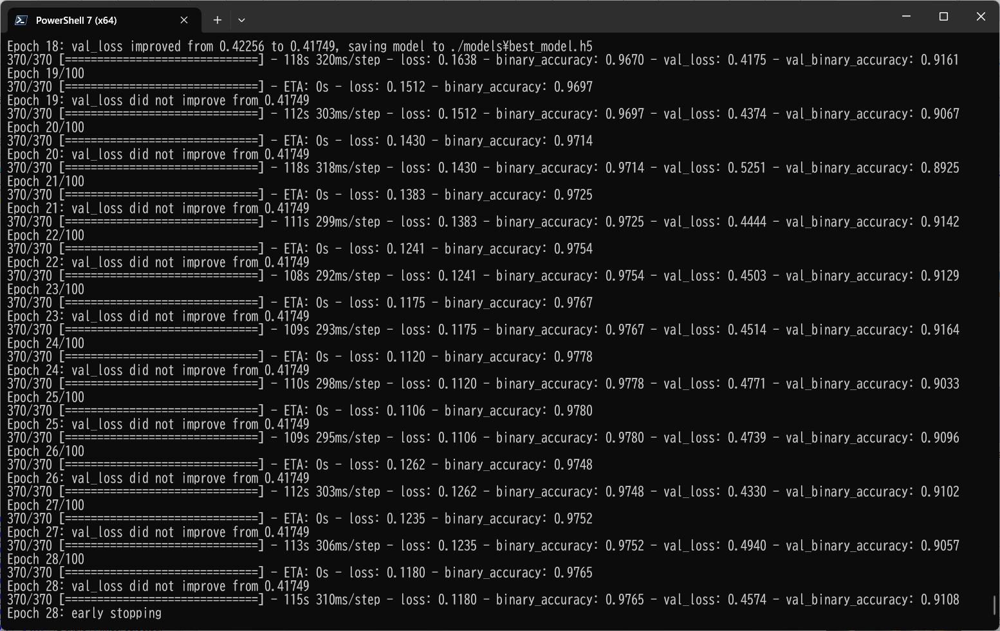
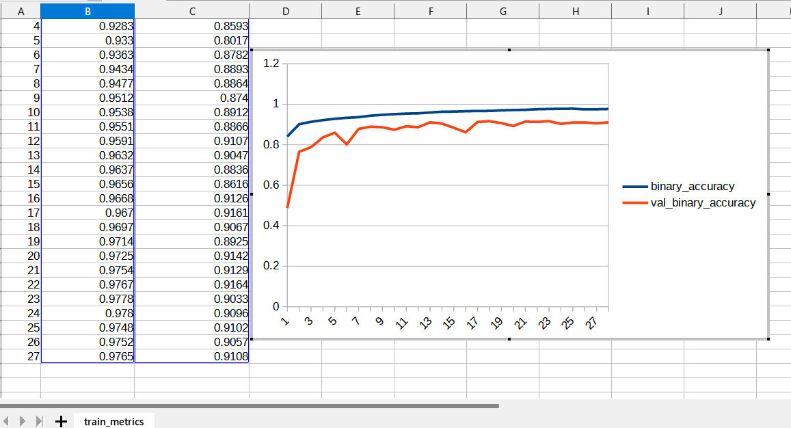
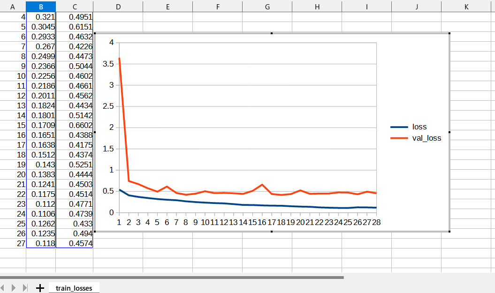
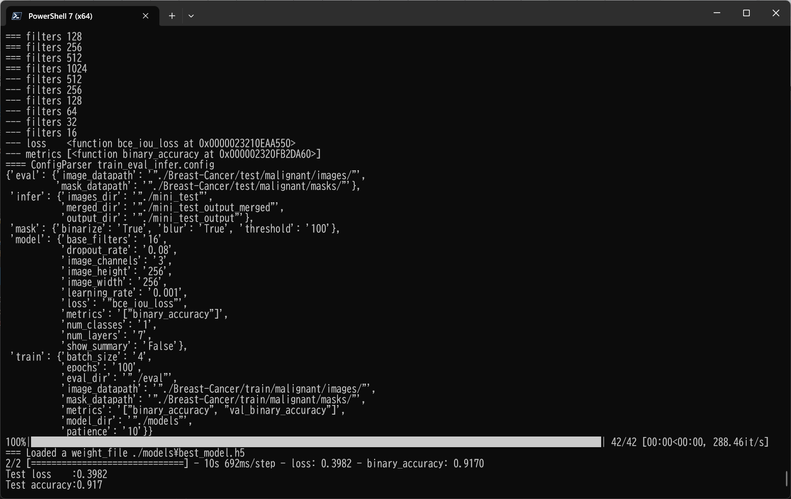
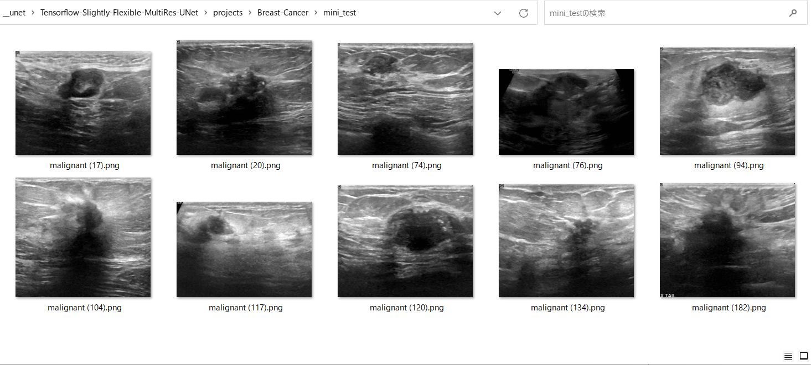
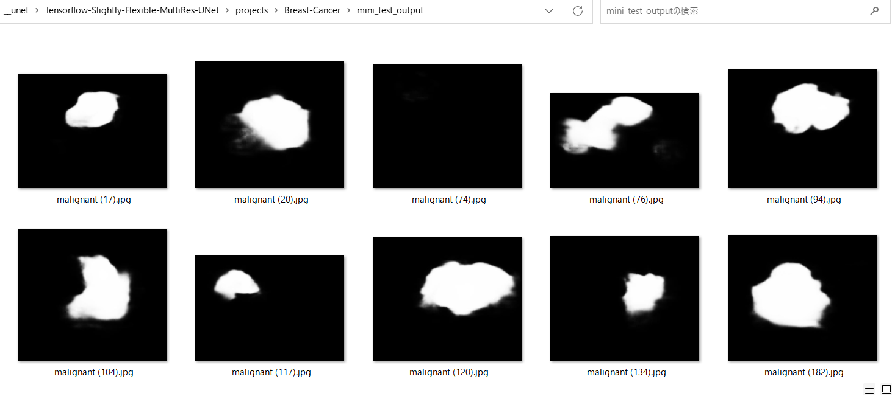
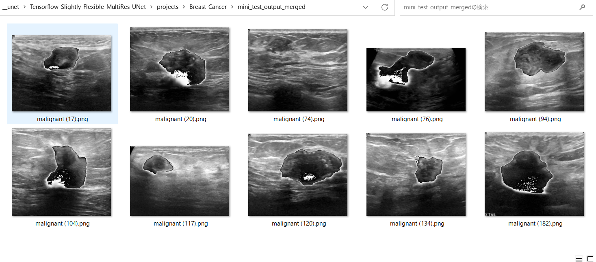

# Tensorflow-Slightly-Flexible-MultiRes-UNet (Updated: 2023/06/24)

<h2>
1 Tensorflow MultiRes UNet Model
</h2>

This is a slightly flexible MultiRes UNet Model Implementation by Tensorflow 2, which is slightly flexibly cusomizable by a configuration file.

In order to write the extensible MultiRes UNet Model, we have used the Python scripts in the following web sites.

<pre>
1. Semantic-Segmentation-Architecture
 https://github.com/nikhilroxtomar/Semantic-Segmentation-Architecture/blob/main/TensorFlow/multiresunet.py
</pre>

See also:

<pre>
2. U-Net: Convolutional Networks for Biomedical Image Segmentation
 https://arxiv.org/pdf/1505.04597.pdf
</pre>

The image dataset used here has been taken from the following web site.

Breast Ultrasound Images Dataset (BUSI), by using our <a href="https://github.com/atlan-antillia/Tensorflow-Slightly-Flexible-UNet">Tensorflow-Slightly-Flexible-UNet Model.</a> 
The original dataset used here has been taken from the following web site: 
<b>Breast Ultrasound Images Dataset</b> 
Breast ultrasound images for classification, detection & segmentation 
<pre>
https://www.kaggle.com/datasets/aryashah2k/breast-ultrasound-images-dataset
</pre>
Citation: 
<pre>
Al-Dhabyani W, Gomaa M, Khaled H, Fahmy A. 
Dataset of breast ultrasound images. Data in Brief. 
2020 Feb;28:104863. 
DOI: 10.1016/j.dib.2019.104863.
</pre>

<h2>
2 Create TensorflowMultiResUNet Model
</h2>
 You can customize your <a href="./TensorflowMultiResUNet.py">TensorflowMultiResUNet</a> model by using a configration file. 
 The following is the case of Breast-Cancer segmentation dataset. 
<pre>
; train_eval_infer.config
; 2023/6/25 antillia.com
; Modified to use loss and metric
; Specify loss as a function nams
; loss =  "binary_crossentropy"
; Specify metrics as a list of function name
; metrics = ["binary_accuracy"]
; Please see: https://www.tensorflow.org/api_docs/python/tf/keras/Model?version=stable#compile

[model]
image_width    = 256
image_height   = 256
image_channels = 3
num_classes    = 1
base_filters   = 16
num_layers     = 7
normalization  = True
learning_rate  = 0.001
loss           = "bce_iou_loss"
metrics        = ["binary_accuracy"]
show_summary   = False

[train]
epochs        = 100
batch_size    = 4
patience      = 10
metrics       = ["binary_accuracy", "val_binary_accuracy"]
model_dir     = "./models"
eval_dir      = "./eval"
image_datapath = "./Breast-Cancer/train/malignant/images/"
mask_datapath  = "./Breast-Cancer/train/malignant/masks/"

[eval]
image_datapath = "./Breast-Cancer/test/malignant/images/"
mask_datapath  = "./Breast-Cancer/test/malignant/masks/"

[infer] 
images_dir    = "./mini_test" 
output_dir    = "./mini_test_output"
merged_dir    = "./mini_test_output_merged"

[mask]
blur      = True
binarize  = True
threshold = 100
</pre>

 
You will pass the filename of this configuration file to <a href="./TensorflowMultiResUNet.py">TensorflowMultiResUNet</a> constructor to create your model 
in the following way: 
<pre>
  config_file = "./train_eval_infer.config"
  model       = TensorflowMultiResUNet(config_file)
</pre>

Our <b>create</b> method of the <b>TensorflowMultiResUNet</b> class which inherits <a href="./TensorflowUNet.py">TensorflowUNet</a> class
 is the following.
It mainly consists of two parts Encoder and Decoder, which are written by <b>for</b> loops depending
on <b>num_layers</b> defined in the configuration file. 
<pre>

class TensorflowMultiResUNet(TensorflowUNet):

  def __init__(self, config_file):
    super().__init__(config_file)

  # The following methods have been take from the following code.
  # https://github.com/nikhilroxtomar/Semantic-Segmentation-Architecture/blob/main/TensorFlow/multiresunet.py
  def conv_block(self, x, num_filters, kernel_size, padding="same", act=True):
    x = Conv2D(num_filters, kernel_size, padding=padding, use_bias=False)(x)
    x = BatchNormalization()(x)
    if act:
        x = Activation("relu")(x)
    return x

  def multires_block(self, x, num_filters, alpha=1.67):
    W = num_filters * alpha

    x0 = x
    x1 = self.conv_block(x0, int(W*0.167), 3)
    x2 = self.conv_block(x1, int(W*0.333), 3)
    x3 = self.conv_block(x2, int(W*0.5),   3)
    xc = Concatenate()([x1, x2, x3])
    xc = BatchNormalization()(xc)

    nf = int(W*0.167) + int(W*0.333) + int(W*0.5)
    sc = self.conv_block(x0, nf, 1, act=False)

    x = Activation("relu")(xc + sc)
    x = BatchNormalization()(x)
    return x

  def res_path(self, x, num_filters, length):
    for i in range(length):
        x0 = x
        x1 = self.conv_block(x0, num_filters, 3, act=False)
        sc = self.conv_block(x0, num_filters, 1, act=False)
        x = Activation("relu")(x1 + sc)
        x = BatchNormalization()(x)
    return x

  def encoder_block(self, x, num_filters, length):
    x = self.multires_block(x, num_filters)
    s = self.res_path(x, num_filters, length)
    p = MaxPool2D((2, 2))(x)
    return s, p

  def decoder_block(self, x, skip, num_filters):
    x = Conv2DTranspose(num_filters, 2, strides=2, padding="same")(x)
    x = Concatenate()([x, skip])
    x = self.multires_block(x, num_filters)
    return x

  # Customizable by the parameters in a configuration file.
  def create(self, num_classes, image_height, image_width, image_channels,
            base_filters = 16, num_layers = 5):
    # inputs
    print("=== TensorflowAttentionUNet.create ")
    print("Input image_height {} image_width {} image_channels {}".format(image_height, image_width, image_channels))
    inputs = Input((image_height, image_width, image_channels))
    p = Lambda(lambda x: x / 255)(inputs)

    enc = []
    for i in range(num_layers):
      filters = base_filters * (2**i)
      if i < num_layers-1:
        s, p = self.encoder_block(p, filters, num_layers-i)
        print("--- Encoder filters {}".format(filters))
        enc.append(s)
      else:
        print("=== Bridge filters {}".format(filters))
        d = self.multires_block(p, filters)

    enc_len = len(enc)
    enc.reverse()
    n = 0
    for i in range(num_layers-1):
      f = enc_len - 1 - i
      filters = base_filters* (2**f)
      print("+++ Decoder filters {}".format(filters))
      s = enc[n]
      d = self.decoder_block(d, s, filters)
      n += 1

    """ Output """
    outputs = Conv2D(num_classes, (1, 1), padding="same", activation="sigmoid")(d)

    """ Model """
    model = Model(inputs=[inputs], outputs=[outputs], name="MultiResUNET")

    return model
</pre>

You can create TensorflowMultiResUNet Model by running the following command. 
<pre>
>python TensorflowMultiResUNet.py train_eval_infer.config
</pre>

<h2>
3 Train TensorflowMultiResUNet Model
</h2>
 We can create and train your TensorflowMultiResUNet model by Breast-Cancer dataset defined in the <b>train_eval_infer.config</b> file. 

We can use <a href="./ImageMaskDataset.py">ImageMaskDataset</a> class to create <b>train</b> and <b>test</b> dataset from the 
the original downloaded file. 
Please move to <b>./projects/Breast-Cancer/</b>, and run the following bat file.
<pre>
>1.train.bat
</pre>
which simply runs the Python script 
<a href="./TensorflowMultiResUNetTrainer.py">TensorflowMultiResUNetTrainer.py</a>
<pre>
python ../../TensorflowMultiResUNetTrainer.py ./train_eval_infer.config
</pre>

In this case, the training process has just been stopped at epoch 28 by an earlystopping callback.  
 
 
<b>Train metrics line graph</b>: 
 

 
<b>Train losses line graph</b>: 
 

<h2>
4 Evaluation
</h2>
 We can evaluate the prediction(segmentation) accuracy in <b>test</b> dataset by using our Trained TensorflowMultiResUNet Model,
and <b>train_eval_infer.config</b> file. 
Please move to <b>./projects/Breast-Cancer/</b>, and run the following bat file.
<pre>
>2.evaluate.bat
</pre>
, which runs the Python script 
<a href="./TensorflowMultiResUNetEvaluator.py">TensorflowMultiResUNetEvaluator.py</a>
<pre>
python ../../TensorflowMultiResUNetEvaluator.py ./train_eval_infer.config
</pre>

 
 

<h2>
5 Inference 
</h2>
 We can infer Breast-Cancer in <b>mini_test</b> dataset, which is a set of ten image files 
extracted from the images in "test" folder. 
Please move to <b>./projects/Breast-Cancer/</b>, and run the following bat file. 
<pre>
3.infer.bat
</pre>
which runs the Python script 
<a href="./TensorflowMultiResUNetInferencer.py">TensorflowMultiResUNetInferencer.py</a>
<pre>
python ../../TensorflowMultiResUNetInferencer.py  ./train_eval_infer.config
</pre>
This inference process will create the grayscale image files with white segmented Breast-Cancer regions,
and those images will have the same size of the original input images respectively. Therefore, you can easily compare 
the input images and the inferred output images.  

<b>Input images (mini_test) </b> 
 
 
<b>Infered images (mini_test_output)</b> 

  

<b>Merged infered images (mini_test_output_merged)</b> 

  

<h3>
References
</h3>

<b>1. Semantic-Segmentation-Architecture</b> 
<pre>
 https://github.com/nikhilroxtomar/Semantic-Segmentation-Architecture/blob/main/TensorFlow/multiresunet.py
</pre>

<b>2. Breast Ultrasound Images Dataset</b> 
<pre>
https://www.kaggle.com/datasets/aryashah2k/breast-ultrasound-images-dataset
</pre>

<b>3. Breast lesion detection using an anchor-free network from ultrasound images with segmentation-based enhancement</b> 
Yu Wang & Yudong Yao 
<pre>
https://www.nature.com/articles/s41598-022-18747-y
</pre>

<b>4. Classification of Breast Cancer Ultrasound Images with Deep Learning-Based Models </b> 
Fatih Uysa,and Mehmet Murat Köse 
<pre>
https://www.mdpi.com/2673-4591/31/1/8/html
</pre>

<b>5. A CNN Deep Learning Technique for Prediction of Breast Cancer using Ultrasound Image
</b> 
Atisham Khan and Silky Pareyani 
<pre>
https://www.jetir.org/papers/JETIR2303813.pdf
</pre>

<b>6. Discrimination of Breast Cancer Based on Ultrasound Images and Convolutional Neural Network
</b> 
Rui Du,Yanwei Chen,Tao Li, Liang Shi,Zhengdong Fei,and Yuefeng Li
 
<pre>
https://www.hindawi.com/journals/jo/2022/7733583/
</pre>

<b>7. EfficientDet-Augmented-Breast-Ultrasound-Images
</b> 
Toshiyuki Arai @antillia.com
 
<pre>
https://github.com/sarah-antillia/EfficientDet-Augmented-Breast-Ultrasound-Images
</pre>

<b>8.Image-Segmentation-Breast-Cancer</b> 
</b> 
Toshiyuki Arai @antillia.com
 
<pre>
https://github.com/atlan-antillia/Image-Segmentation-Breast-Cancer
</pre>

<b>9. Semantic-Segmentation-Loss-Functions (SemSegLoss)</b> 
<pre>
https://github.com/shruti-jadon/Semantic-Segmentation-Loss-Functions
</pre>
<pre>
Citation
@inproceedings{jadon2020survey,
  title={A survey of loss functions for semantic segmentation},
  author={Jadon, Shruti},
  booktitle={2020 IEEE Conference on Computational Intelligence in Bioinformatics and Computational Biology (CIBCB)},
  pages={1--7},
  year={2020},
  organization={IEEE}
}
@article{JADON2021100078,
title = {SemSegLoss: A python package of loss functions for semantic segmentation},
journal = {Software Impacts},
volume = {9},
pages = {100078},
year = {2021},
issn = {2665-9638},
doi = {https://doi.org/10.1016/j.simpa.2021.100078},
url = {https://www.sciencedirect.com/science/article/pii/S2665963821000269},
author = {Shruti Jadon},
keywords = {Deep Learning, Image segmentation, Medical imaging, Loss functions},
abstract = {Image Segmentation has been an active field of research as it has a wide range of applications, 
ranging from automated disease detection to self-driving cars. In recent years, various research papers 
proposed different loss functions used in case of biased data, sparse segmentation, and unbalanced dataset. 
In this paper, we introduce SemSegLoss, a python package consisting of some of the well-known loss functions 
widely used for image segmentation. It is developed with the intent to help researchers in the development 
of novel loss functions and perform an extensive set of experiments on model architectures for various 
applications. The ease-of-use and flexibility of the presented package have allowed reducing the development 
time and increased evaluation strategies of machine learning models for semantic segmentation. Furthermore, 
different applications that use image segmentation can use SemSegLoss because of the generality of its 
functions. This wide range of applications will lead to the development and growth of AI across all industries.
}
}
</pre>
 
